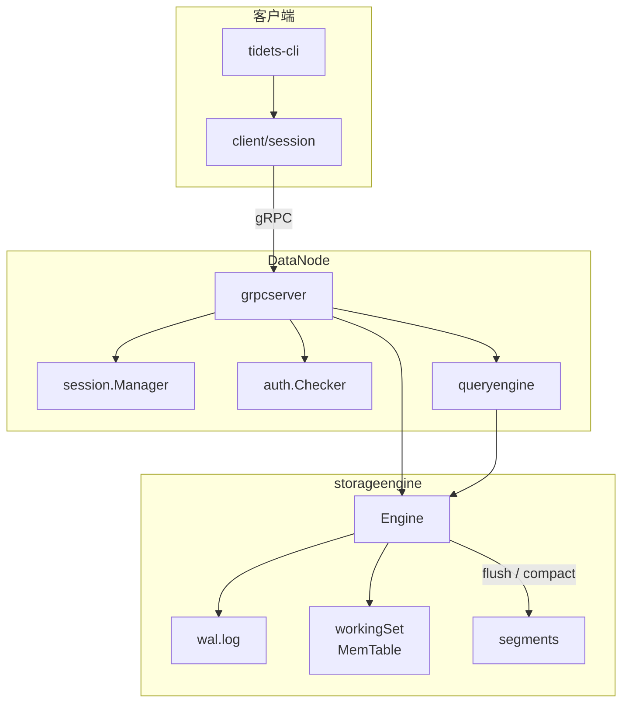
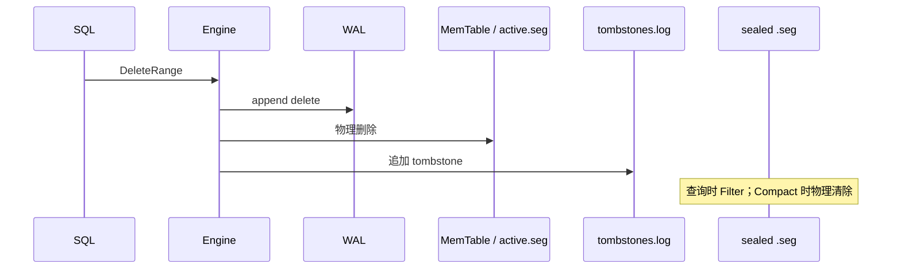

# TideTS

Go 实现的 IoTDB 风格单机时序库（学习项目）：gRPC Session、自研 `.seg` 存储、WAL + MemTable。

**特性概览**

- 存储：WAL → 双 MemTable → Segment（mmap）→ Compaction + Tombstone
- 接入：gRPC Session 协议；Go SDK（`client/session`）
- 查询：SQL（INSERT / SELECT / COUNT / DELETE / DDL / SHOW）+ RPC 点查
- 可观测：Prometheus `/metrics`（Hooks 解耦）
- 压测：E2E Benchmark（`scripts/bench`）

**当前限制**：单机、无集群；鉴权仅 `root` 单用户；官方 SDK 为 Go。

---

## 快速开始

### 依赖

- Go 1.26+
- `protoc` + `protoc-gen-go` + `protoc-gen-go-grpc`（仅修改 `.proto` 时需要）
- JDK（仅修改 `antlr/grammar/TideSQL.g4` 时需要；`make sql-gen` 会自动下载 ANTLR jar）

```bash
make test    # 单元测试
make build   # 编译 bin/datanode、bin/tidets-cli
```

### 1. 启动 DataNode

```bash
go run ./cmd/datanode -data-dir ./data -wal-sync onflush -metrics-addr :9090
```

| 参数 | 默认 | 说明 |
|------|------|------|
| `-addr` | `:5556` | gRPC 监听地址 |
| `-data-dir` | `./data` | 数据目录（WAL + segments） |
| `-wal-sync` | `always` | WAL 同步策略：`always` \| `onflush` |
| `-metrics-addr` | `:9090` | Prometheus HTTP；置空关闭 |

默认账号：`root` / `root`

### 2. 使用 CLI（推荐入门）

```bash
go run ./cmd/tidets-cli -host 127.0.0.1 -port 5556
```

在 `tidets>` 提示符下输入 SQL（以 `;` 结束），`exit` / `quit` 退出。

### 3. 使用 Go SDK

```
ctx := context.Background()
s, _ := session.New()
_ = s.Open(ctx)
defer s.Close()

_ = s.InsertPoint(ctx, "root.sg1.d1", "temperature", 100, session.Double(25.5))
res, _ := s.ExecuteSQL(ctx, "SELECT temperature FROM root.sg1.d1 WHERE time >= 100 AND time <= 200")
points, _ := s.QueryRange(ctx, "root.sg1.d1", "temperature", 100, 200)
```

`import "github.com/hanami/tidets/client/session"`  
完整可运行示例见 [`examples/session_sql_test.go`](examples/session_sql_test.go)。

---

## 客户端使用

### 接入方式

| 方式 | 适用场景 | 入口 |
|------|----------|------|
| **SQL CLI** | 人工调试、演示 | `cmd/tidets-cli` |
| **Go SDK** | 业务集成（推荐） | `client/session` |
| **gRPC 直连** | 非 Go 语言 / 高级用户 | `protocol/grpc-datanode/` |

典型流程：`OpenSession` → 写入（`InsertBatch` / `INSERT`）→ 查询（`QueryRange` / `SELECT`）→ `CloseSession`

### Session API

| 方法 | 说明 |
|------|------|
| `New` / `Open` / `Close` | 连接与登录 |
| `InsertPoint` / `InsertBatch` | RPC 写入 |
| `QueryRange` / `QueryRangeWithLimit` | RPC 范围查询 |
| `ExecuteSQL` | SQL 执行 |
| `SetFetchSize` | `QueryRange` 默认条数上限 |

支持值类型：`Boolean`、`Int32`、`Int64`、`Float`、`Double`、`Text`（见 `client/session/value.go`）。

环境变量：`TIDETS_HOST`（默认 `127.0.0.1`）、`TIDETS_PORT`（默认 `5556`）。

### SQL 示例

```sql
INSERT INTO root.sg1.d1(temperature) VALUES (100, 25.5);
INSERT INTO root.sg1.d1(temperature) VALUES (100, 25.5), (101, 26.0);
SELECT temperature FROM root.sg1.d1 WHERE time >= 100 AND time <= 200 LIMIT 10;
SELECT COUNT(temperature) FROM root.sg1.d1 WHERE time >= 100 AND time <= 200;
DELETE FROM root.sg1.d1(temperature) WHERE time >= 100 AND time <= 200;
CREATE TIMESERIES root.sg1.d1(temperature) WITH DATATYPE=DOUBLE;
SHOW DEVICES root.sg1.**;
SHOW TIMESERIES root.sg1.d1;
```

- 同时间戳再次 `INSERT` 为覆盖写（upsert）
- `DELETE` 必须带 `WHERE` 时间条件

### 端到端测试

```bash
# 终端 1：DataNode
go run ./cmd/datanode -data-dir ./data

# 终端 2
go test ./examples/... -run TestSessionInsertLifecycle -count=1
```

---

## Benchmark

基于 `client/session` 的 E2E 压测，位于 `scripts/bench/`，需先启动 DataNode。

**推荐写入压测（单机）：**

```bash
# 终端 1
go run ./cmd/datanode -data-dir ./data -wal-sync onflush

# 终端 2
CONCURRENCY=10 BATCH_SIZE=1000 POINTS=100000 WARMUP=50 \
  ./scripts/run_bench.sh insert_batch
```

或使用脚本默认值：

```bash
./scripts/run_bench.sh insert_batch
```

**支持的 workload**：`insert_point` · `insert_batch` · `query_range` · `count_sql` · `delete_sql`

| 参数 / 环境变量 | 说明 |
|-----------------|------|
| `-op` | 操作类型 |
| `-host` / `-port` | DataNode 地址（或 `TIDETS_HOST` / `TIDETS_PORT`） |
| `-points` | 总逻辑点数 |
| `-batch-size` / `BATCH_SIZE` | batch 大小 |
| `-concurrency` / `CONCURRENCY` | 并发 worker |
| `-warmup` / `WARMUP` | 预热次数 |
| `-metrics` + `-result-dir` | 输出 metrics 快照与 `result.json` |

输出：延迟（avg / p50 / p95 / p99）、`req/s`、`items/s`、错误数。

---

## Metrics（Prometheus）

```bash
curl -s http://127.0.0.1:9090/metrics | rg '^tidets_'
```

| 前缀 | 内容 |
|------|------|
| `tidets_storage_*` | 状态 gauge；写/读路径计数与延迟；WAL / tombstone / flush / compact 事件 |
| `tidets_grpc_*` | RPC 请求数、延迟、业务条数（`request_items` / `response_items`） |
| `tidets_sql_*` | SQL 按 plan kind、成功/失败（`error_class`）分类 |
| `tidets_session_active` | 活跃 Session 数 |
| `tidets_node_*` / `tidets_build_info` | 节点 uptime、构建信息 |

所有 label 保持低基数（`method`、`code`、`kind`、`op`、`success`、`error_class`），不包含 `device_path` 等高基数字段。可对接 Grafana / Prometheus，仓库内不提供预制 Dashboard。

---

## 架构



**写入**：`Insert RPC → WAL → MemTable → flush → active.seg → seal → NNNNNN.seg`

**查询**：`MemTable ∪ segments → merge → tombstone 过滤 → 返回`

**删除**：

- `active.seg`：**物理删除**
- sealed `.seg`：**逻辑删除**（tombstone），compaction 后物理清除



---

## 数据目录

```text
data/
├── system/schema/
│   ├── mlog.bin            # 元数据 DDL 日志
│   └── mtree.snapshot      # MTree 快照
├── wal.log                 # 点数据 WAL
├── wal.checkpoint          # WAL 回放起点
├── tombstones.log          # 删除区间持久化
└── segments/
    ├── active.seg          # 当前可追加 segment
    └── 000001.seg          # 封存只读 segment
```

### 修改磁盘格式后

本仓库只维护当前一种二进制布局。若修改 segment / WAL / mlog / snapshot 格式，需清空数据目录：

```bash
rm -rf ./data
go run ./cmd/datanode -data-dir ./data
```

---

## 项目结构

```text
cmd/
  datanode/              # 服务端
  tidets-cli/            # SQL CLI
cli/repl/                # REPL
client/session/          # Go SDK
core/
  storageengine/         # WAL / MemTable / segment / tombstone
  queryengine/           # SQL 执行
  schemaengine/          # MTree / mlog / snapshot
  datanode/              # gRPC / session / auth
  metrics/               # Prometheus
  sql/                   # ANTLR parser
scripts/bench/           # E2E 压测
examples/                # 端到端测试
protocol/grpc-datanode/  # gRPC 协议
antlr/                   # TideSQL 语法
```

### 开发命令

```bash
make proto    # 生成 gRPC pb（修改 .proto 后）
make sql-gen  # 生成 SQL parser（修改 TideSQL.g4 后）
make test     # 全量测试
make build    # 编译 datanode + tidets-cli
make bench-help
```

---

## License

MIT — 见 [LICENSE](LICENSE)。
