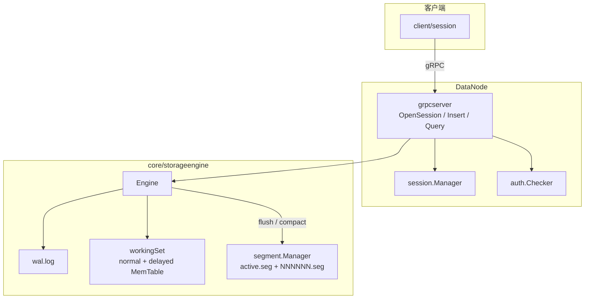

# TideTS

Go 实现的 IoTDB 风格单机时序库（学习项目）：gRPC Session、自研 `.seg` 存储、WAL + MemTable。

## 快速开始

### 依赖

- Go 1.26+
- `protoc` + `protoc-gen-go` + `protoc-gen-go-grpc`（仅修改 `.proto` 时需要）
- JDK（仅修改 `antlr/grammar/TideSQL.g4` 时需要；`make sql-gen` 会自动下载 ANTLR jar，见 `tools/antlr/README.md`）

```bash
make proto   # 生成 protocol/grpc-datanode/pb/
make sql-gen # 修改 TideSQL.g4 后重新生成 parser
make test    # 单元测试
```

### 启动 DataNode

```bash
go run ./cmd/datanode -data-dir ./data
```

常用参数：

| 参数 | 默认 | 说明 |
|------|------|------|
| `-addr` | `:5556` | gRPC 监听地址 |
| `-data-dir` | `./data` | 数据目录（WAL + segments） |

编译二进制：

```bash
mkdir -p bin
go build -o bin/datanode ./cmd/datanode
./bin/datanode -data-dir ./data
```

默认账号：`root` / `root`（见 `client/session` 与 `core/datanode/auth`）。

### Session API（`client/session`）

可视化前端、CLI、测试统一使用此包（gRPC + 服务端 Session）：

| 方法 | 说明 |
|------|------|
| `New` / `Open` / `Close` / `IsOpen` | 连接与登录，获取 `session_id` |
| `SessionID()` | 服务端会话 ID |
| `InsertPoint` / `InsertBatch` | 写入测点 |
| `QueryRange` / `QueryRangeWithLimit` | 按时间范围查询 |
| `ExecuteSQL` | 最简 SQL：`INSERT` / `SELECT` |
| `SetFetchSize` | 影响 `QueryRange` 默认条数上限 |

完整可编译示例见 [`examples/session_sql_test.go`](examples/session_sql_test.go)。

```text
ctx := context.Background()
s, _ := session.New()
s.Open(ctx)
defer s.Close()

s.InsertPoint(ctx, "root.sg1.d1", "temperature", 100, session.Double(25.5))
s.ExecuteSQL(ctx, "SELECT temperature FROM root.sg1.d1 WHERE time >= 100 AND time <= 200")
s.QueryRangeWithLimit(ctx, "root.sg1.d1", "temperature", 100, 200, 1000)
```

（`import "github.com/hanami/tidets/client/session"`，需先 `go mod download`。）

支持类型：`Boolean`、`Int32`、`Int64`、`Float`、`Double`、`Text`（`client/session/value.go`）。

### SQL CLI（推荐）

终端 1 启动 DataNode，终端 2 启动交互式 SQL：

```bash
go run ./cmd/datanode -data-dir ./data
go run ./cmd/tidets-cli -host 127.0.0.1 -port 5556
```

或 `make build-cli && ./bin/tidets-cli`。在 `tidets>` 提示符下输入 SQL（以 `;` 结束），`exit` / `quit` 退出。

### 最简 SQL（INSERT / SELECT）

通过 Session `ExecuteSQL` 或 gRPC `ExecuteSQL` 执行（需先 `OpenSession`）：

```sql
INSERT INTO root.sg1.d1(temperature) VALUES (100, 25.5);
SELECT temperature FROM root.sg1.d1 WHERE time >= 100 AND time <= 200 LIMIT 10;
```

- 关键字大小写不敏感（`insert` / `INSERT` 均可）。
- `WHERE` 可省略（全时间范围）；`LIMIT` 可省略（默认 10000）。
- 同时间戳再次 `INSERT` 视为覆盖写（upsert）。

### 端到端测试

```bash
# 终端 1
go run ./cmd/datanode -data-dir ./data

# 终端 2
go test ./examples/... -run TestSessionInsertLifecycle -count=1
```

可选环境变量：`TIDETS_HOST`（默认 `127.0.0.1`）、`TIDETS_PORT`（默认 `5556`）。

## data-dir 目录结构

```text
data/
├── wal.log                 # 预写日志（崩溃恢复）
└── segments/
    ├── active.seg          # 当前可追加的 segment
    └── 000001.seg          # 封存后的只读 segment
```

- **WAL**：在线写入先落盘，再进 MemTable；全部 flush 且 MemTable 为空后可重置。
- **segments**：MemTable 刷盘写入；多次 flush 可追加到 `active.seg`，达到阈值后 seal 为编号 `.seg`，并可 compaction 合并。

## 修改磁盘格式后怎么办？

本仓库**只维护当前一种** `.seg` / WAL 布局，不读取旧格式文件。

若你改了 `core/storageengine/segment/format.go` 里的 `version`、chunk 布局，或 `core/storageengine/wal/record.go` 的记录格式：

```bash
# 停掉 DataNode 后
rm -rf ./data
go run ./cmd/datanode -data-dir ./data
```

否则会报错，例如：`segment: unsupported file version …, remove data-dir/segments`。

## 架构简图



写入路径（简化）：

```text
Insert RPC → Engine → WAL → MemTable → (满/Flush) → active.seg → seal → 00000N.seg
查询路径：MemTable(normal+delayed) ∪ 已加载 .seg → 归并 → 按时间范围 + limit 返回
```

## 项目结构

```text
cmd/datanode/          # 服务端 main
cmd/tidets-cli/        # SQL 交互 CLI（Session + ExecuteSQL）
cli/
  repl/                # 交互式 SQL 循环（使用 client/session）
  format/              # 结果格式化
client/session/        # 官方 Session SDK（前端/BFF/CLI 共用）
commons/errors/        # 统一错误类型与 gRPC 映射
protocol/
  grpc-datanode/       # .proto + pb 生成代码
  convert/             # TSValue ↔ model.Value
antlr/                 # TideSQL.g4 + 生成的 parser
core/
  sql/                 # AST / visitor / planner
  queryengine/         # 执行计划、Executor、Service
  datanode/
    grpcserver/        # gRPC 实现（含 ExecuteSQL）
    session/           # 会话管理
    auth/              # 鉴权
    sink/              # SQL 结果 → protobuf
  storageengine/       # 存储引擎（WAL / MemTable / segment）
examples/              # 端到端测试
```

## License

MIT — 见 [LICENSE](LICENSE)。
